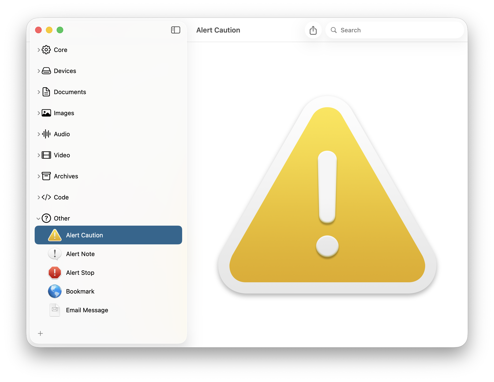

# Icns Extractor

A macOS SwiftUI app that lets you extract and export icons (`.icns` / `.png`) from apps, files or folders. Preview the icons in different sizes and save them easily.

---

## 📂 Features

- Sidebar to add apps, files or folders
- Icon preview of the selected item
- Export/save icons (as `.icns` or `.png`)
- Support for multiple standard icon sizes (16, 32, 64, 128, 256, 512, 1024)
- Simple drag & drop / open panel for adding items

---

## 🧰 Requirements

- macOS 15.0 or later
- Xcode 15 or later

---
